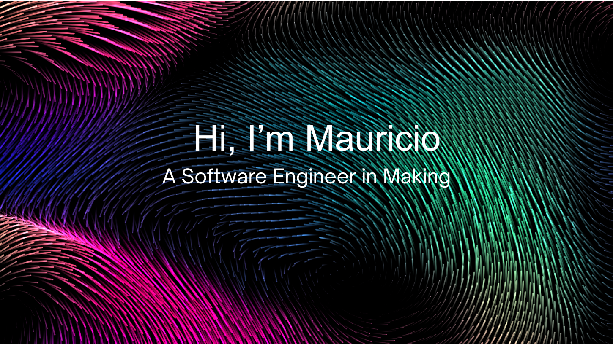

I'm a Computer Science student at Florida International University graduating December 2026, passionate about backend engineering and distributed systems. Currently building **CodeSync**, a real-time collaborative code editor with Go and WebSockets, and seeking Summer 2026 internships at companies building scalable infrastructure.

## Tech Stack

## GitHub Stats

## Let's Connect

